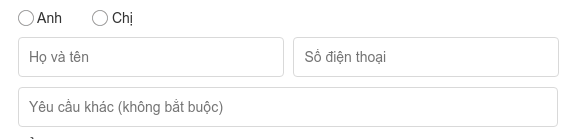

### Bài toán: Validate 1 field

Bắt chước tính năng validate form như hình dưới (thegioididong.com):



Yêu cầu:
1. Chỉ cần kiểm tra xem số điện thoại nhập vào có bao gồm 10 đến 11 chữ số hay không.
2. Việc kiểm tra chỉ được thực hiện khi chuyển ra ngoài vùng nhập điện thoại (ví dụ khi click chuột ra chỗ khác, hoặc tab chuyển sang vùng khác).
3. Thông báo màu đỏ "*Số điện thoại phải có 10 - 11 chữ số*" hiện bên dưới khi có lỗi, và biến mất khi không có lỗi.

### Thực hiện

Với 2 yêu cầu trên, hướng làm chung là:

- **Yêu cầu 1**: Sử dụng regular expression để kiểm tra chuỗi. Tạo method `validateInput()` dựa vào regular expression nói trên, nhận vào là string, trả về kết quả là 1 object `{isInputValid: boolean, errorMessage: string}`.

    ```js
    const validateInput = (checkingText) => {
        /* reg exp để kiểm tra xem chuỗi có chỉ bao gồm 10 - 11 chữ số hay không */
        
        const regexp = /^\d{10,11}$/;
        const checkingResult = regexp.exec(checkingText);
        if (checkingResult !== null) {
            return { isInputValid: true,
                     errorMessage: ''};
        } else {
            return { isInputValid: false,
                     errorMessage: 'Số điện thoại phải có 10 - 11 chữ số.'};
        }
    }
    ```

- **Yêu cầu 2**: 
    - Việc kiểm tra sẽ dựa vào event handler ["onblur" trong dãy FocusEvent Object](https://www.w3schools.com/jsref/obj_focusevent.asp). 
    - Truyền hàm callback vào event handler `onBlur` của `<input>`, callback này chính là method `validateInput` nói trên.
    - Hàm callback này sẽ nhận vào value của input thông qua `this.state.value`. State này là của component cha chứa `<input>`.
    - Để hàm callback luôn nhận value mới nhất của input, thì bản thân input cũng phải có event handler `onChange`, cập nhật liên tục input value vào state (thông qua `setState()`).
    - Trong state, ngoài thuộc tính `value`, còn cần có thuộc tính `isInputValid`, và `errorMessage` để chứa kết quả trả về sau khi validate nội dung.

    ```html
    <!-- Setup component input và FormError-->
    <input
        name="fullname"
        onChange={this.handleInput}
        onBlur={this.handleInputValidation} />
    ```

    ```javascript
    /* Tạo object state trong constructor của component cha chứa input */

        this.state = { 
            value: '',
            isInputValid: true, 
            errorMessage: ''
        }, 
    ```

    ```javascript 
    /* Tạo method handleInput để cập nhật giá trị trong ô input vào state */
    handleInput = event => {
        const { value } = event.target;
        this.setState({value});
    }
    ```

    ```javascript
    /* Tạo method handleInputValidation để kiểm tra nội dung input, rồi cập nhật trạng thái vào state*/

    handleInputValidation = event => {
        const { isInputValid, errorMessage } = validateInput(this.state.value);
        this.setState({
            isInputValid: isInputValid,
            errorMessage: errorMessage
        })
    }
    ```

- **Yêu cầu 3**: Tạo 1 component (dạng function) `<FormError />` đặt bên dưới của `<input>`. Component `<FormError />` sẽ nhận 2 props:
    - Prop `isHidden` (gán bằng `this.state.isInputValid`):
        - Nếu `isHidden = true` thì ẩn form đi.
        - Nếu `isHidden = false`, thì hiện form ra. 
    - Prop `errorMessage` (gán bằng `this.state.errorMessage`). 
    Nội dung trong form là của `props.errorMessage`.

    ```html
    <!-- setup component input và FormError-->
    <input ... />
    <FormError 
        isHidden={this.state.isInputValid} 
        errorMessage={this.state.errorMessage} />
    ```

    ```javascript
    function FormError(props) {
        /* nếu isHidden = true, return null ngay từ đầu */

        if (props.isHidden) { return null;}

        const customStyle = { display: ''};
        return ( <div style={customStyle}>{props.errorMessage}</div>)
    }
    ```

Sample code xem tại đây:

### Nếu cần validate từ 2 input trở lên?

Nếu muốn validate không những *phonenumber* mà cả *fullname* (Họ và tên không được có ký tự số), hoặc nhiều input nữa trong 1 cụm?  Về logic vẫn làm theo cách trên, nhưng chú ý thêm về:


0. Setup html, 2 `<input>` với attribute `name` rõ ràng, kèm theo 2 component `<FormError />`:

    ```html
    <!-- Setup component input và FormError-->
    <input
        name="fullname"
        onChange={this.handleInput}
        onBlur={this.handleInputValidation} />
    <FormError
        type="fullname"
        isHidden={this.state.fullname.isInputValid} 
        errorMessage={this.state.fullname.errorMessage} />
    <input
        name="phonenumber"
        onChange={this.handleInput}
        onBlur={this.handleInputValidation} />
    <FormError
        type="fullname"
        isHidden={this.state.fullname.isInputValid} 
        errorMessage={this.state.fullname.errorMessage} />
    ```

1. Cấu trúc object `state` sao để việc `setState()` cho những tầng sâu bên dưới được thuận lợi. Lúc đầu mình đặt object `state` khá lủng củng, nên không sao truyền giá trị mới cho những thuộc tính mình cần. Cách tạo object đề nghị cho phần này:

    ```javascript
    /* Tạo object state trong constructor của component cha chứa input */

        this.state = { 
                phonenumber: {
                    value: '',
                    isInputValid: true, 
                    errorMessage: ''
                },
                fullname: {
                    value : '',
                    isInputValid: true, 
                    errorMessage: ''
                }
            }
        }, 
    ```

2. Hàm `validateInput` sẽ phải viết lại, bổ sung thêm việc kiểm tra `type` (là *phonenumber* hay *fullname*), và thêm regular expression để kiểm tra riêng cho *fullname*).

    ```javascript
    const validateInput = (type, checkingText) => {
        if (type === "phonenumber") {
            /* Kiểm tra phonenumber */
        }

        if (type === "fullname") {
            /* Kiểm tra fullname */
        }
    }
    ```

3. Sau cùng, điều chỉnh `handleInput` và `handleInputValidation` để có thể setState một cách tổng quan, không phải quan tâm đến `name` của từng `<input>`. Đoạn này mình google theo keyworld "**ReactJS setstate deeply nested**". Những bài như [How to update a nested state in React](https://stackoverflow.com/questions/43040721/how-to-update-a-nested-state-in-react), hay bài [this.setState isn't merging states as I would expect
](https://stackoverflow.com/questions/18933985/this-setstate-isnt-merging-states-as-i-would-expect), có nói đến các phương pháp như:
    - Dùng `react-addon-update`
    - Dùng library `immutability-helper`
    - Dùng hàm `_merge()` trong thư viện `lodash`.
    - Dùng `Object.assign({}, .....)`

    Sau cùng, quyết định:
    - tạo thêm 1 dummy object, 
    - sử dụng spread operator 
    
    để copy (shallow copy) state vào dummy object, sau đó truyền ngược trở lại vào state như tham khảo ở 1 câu [trả lời](https://stackoverflow.com/questions/43040721/how-to-update-a-nested-state-in-react?answertab=votes#tab-top).

    ```javascript

    handleInput = event => {
        const { name, value } = event.target;
        const newState = {...this.state[name]}; /* dummy object */
        newState.value = value;
        this.setState({[name]: newState});
    }

    handleInputValidation = event => {
        const { name } = event.target;
        const { isInputValid, errorMessage } = validateInput(name, this.state[name].value);
        const newState = {...this.state[name]}; /* dummy object */
        newState.isInputValid = isInputValid;
        newState.errorMessage = errorMessage;
        this.setState({[name]: newState})
    }
    ```

4. Vấn đề styling cần phải tùy chỉnh tùy theo nhu cầu.


